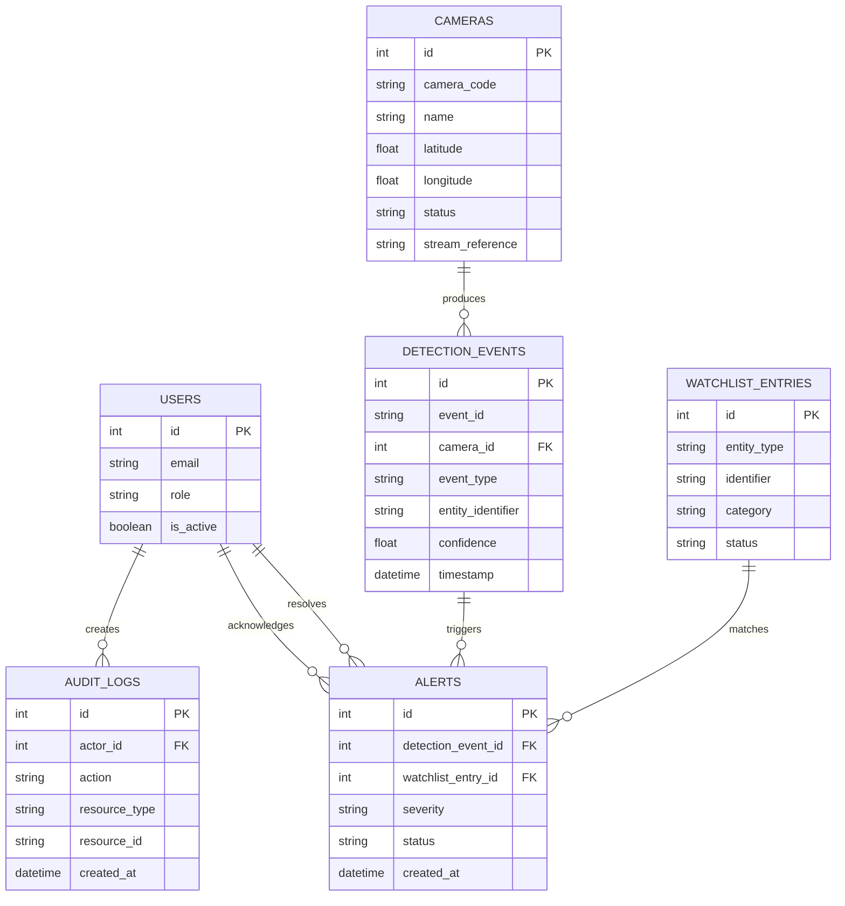

```mermaid
erDiagram
  USERS ||--o{ AUDIT_LOGS : creates
  USERS ||--o{ ALERTS : acknowledges
  USERS ||--o{ ALERTS : resolves
  CAMERAS ||--o{ DETECTION_EVENTS : produces
  DETECTION_EVENTS ||--o{ ALERTS : triggers
  WATCHLIST_ENTRIES ||--o{ ALERTS : matches

  USERS { int id PK string email string role boolean is_active }
  CAMERAS { int id PK string camera_code string name float latitude float longitude string status string stream_reference }
  DETECTION_EVENTS { int id PK string event_id int camera_id FK string event_type string entity_identifier float confidence datetime timestamp }
  WATCHLIST_ENTRIES { int id PK string entity_type string identifier string category string status }
  ALERTS { int id PK int detection_event_id FK int watchlist_entry_id FK string severity string status datetime created_at }
  AUDIT_LOGS { int id PK int actor_id FK string action string resource_type string resource_id datetime created_at }
```
